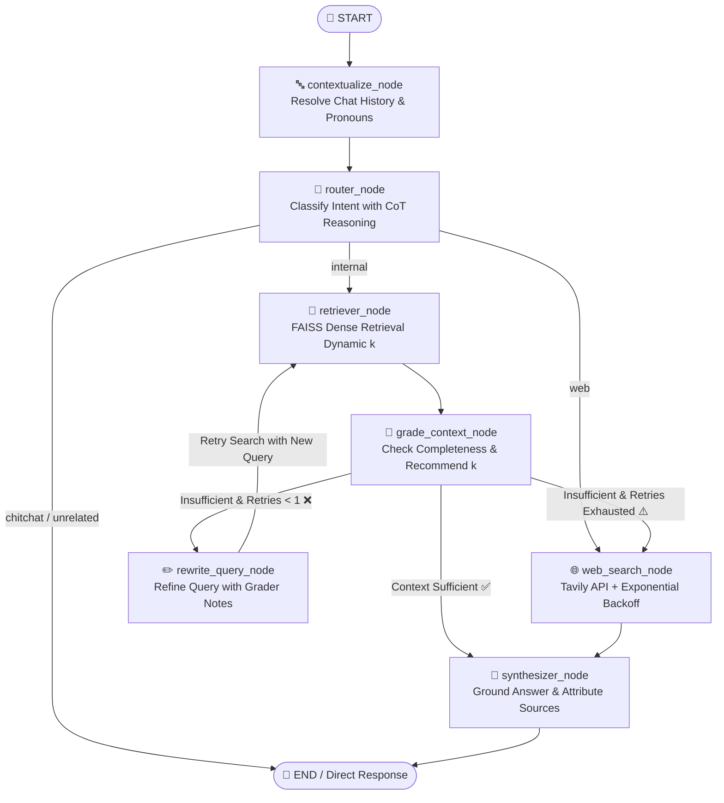

# ☁️ Kara — Dual-Source Self-Reflective Agentic RAG Assistant

[](https://www.python.org/)
[](https://langchain-ai.github.io/langgraph/)
[](https://www.langchain.com/)
[](https://groq.com/)
[](https://github.com/facebookresearch/faiss)
[](https://tavily.com/)
[](https://streamlit.io/)
[](https://github.com/astral-sh/uv)

An enterprise-grade **Agentic Retrieval-Augmented Generation (RAG)** assistant built with **LangGraph**, **Groq**, **FAISS**, and **Tavily AI**. **Kara** specializes in AWS Cloud Architecture, combining static knowledge from the **AWS Well-Architected Framework** with live web retrieval for dynamic operational data (pricing, service health, and recent re:Invent announcements).

Featuring a **Self-Corrective RAG (CRAG)** architecture, the system autonomously evaluates retrieved context, dynamically scales chunk retrieval depth ($k$), reformulates failed queries based on grader reasoning feedback, and gracefully falls back to web search when internal documentation is insufficient.

---

## 🚀 Key Highlights & Agentic Capabilities

- **🧭 Intelligent Multi-Route Intent Classifier**: Evaluates contextualized queries with Chain-of-Thought (CoT) reasoning to route into `internal` (AWS docs), `web` (live prices/outages), `chitchat` (conversational), or `unrelated` (off-topic deflection).
- **🔁 Self-Corrective RAG (CRAG) Feedback Loop**: Evaluates context completeness via a dedicated Grader LLM. If the retrieved context contains missing elements, the system reformulates the query using targeted grader notes and retries retrieval.
- **📊 Dynamic Retrieval Scaling ($k$-tuning)**: The Grader LLM dynamically adjusts chunk retrieval density ($k \in [4, 10]$) based on whether context was merely truncated vs. completely off-topic.
- **🛡️ Multi-Pool Rate Limit Resilience**: Distributes workload across three independent Groq model families (`openai/gpt-oss-20b`, `openai/gpt-oss-120b`, `qwen/qwen3.6-27b`) with automatic cross-fallbacks on every graph node.
- **🧹 Content-Hash Chunk Deduplication**: Prevents duplicate text chunks and bloated context windows across retrieval retry cycles using MD5 content hashing.
- **⚡ Live Node-Level Streaming UX**: Interactive Streamlit interface utilizing `agent_graph.stream(stream_mode="updates")` to display step-by-step reasoning, routing badges, grader assessments, and query rewrites in real time.
- **🔒 Anti-Hallucination & Prompt Injection Defenses**: Strict schema-enforced JSON generation for all decision-making nodes, accompanied by system prompt isolation against untrusted web scrape data.

---

## 🏗️ System Architecture & Graph Flow

The agentic pipeline is modeled as a state machine using **LangGraph**:



---

## 🔬 Graph Node Execution Breakdown

| Node Name | Primary Model | Fallback Model | Primary Responsibility |
| :--- | :--- | :--- | :--- |
| **`contextualize_node`** | `qwen/qwen3.6-27b` | `openai/gpt-oss-20b` | Inspects previous conversation turns and reformulates follow-up queries into self-contained standalone statements. |
| **`router_node`** | `openai/gpt-oss-20b` | `qwen/qwen3.6-27b` | Classifies intent into `internal`, `web`, `chitchat`, or `unrelated`. Direct responses are emitted for chitchat/out-of-scope queries to avoid redundant retrieval costs. |
| **`retriever_node`** | *Local Embedding* | — | Retrieves top-$k$ document chunks from the local FAISS index using `sentence-transformers/all-MiniLM-L6-v2` with thread-safe caching and MD5 deduplication. |
| **`grade_context_node`** | `qwen/qwen3.6-27b` | `openai/gpt-oss-20b` | Strictly grades context sufficiency against query requirements under zero-outside-knowledge assumptions and selects the next target $k$. |
| **`rewrite_query_node`** | `openai/gpt-oss-20b` | `qwen/qwen3.6-27b` | Uses the grader's diagnostic feedback to rewrite the query focusing on missing technical terminology. Increments `retry_count`. |
| **`web_search_node`** | *Tavily API* | — | Fetches real-time web context with exponential backoff and randomized jitter to handle rate limits or network drops. |
| **`synthesizer_node`** | `openai/gpt-oss-120b` | `qwen/qwen3.6-27b` | High-parameter reasoning model synthesizing final responses grounded strictly in cited context with JSON schema validation. |

---

## ⚖️ Architectural Strengths vs. Known Limitations & Trade-Offs

A rigorous evaluation of design decisions, engineering trade-offs, and production considerations:

### 🌟 Core Architectural Strengths
1. **Self-Healing Corrective Loop**: Unlike standard naive RAG pipelines that hallucinate when initial retrieval misses, the agent self-evaluates, reformulates keywords, and escalates to external search if the document corpus lacks the answer.
2. **Dynamic In-Flight Parameter Tuning**: Retrieval depth ($k$) is not hardcoded; it adapts dynamically based on whether context was partially truncated ($k+2$) or completely off-topic ($k=10$).
3. **Multi-Tier Pool Isolation**: By splitting LLM tasks across `gpt-oss-20b` (fast/low-cost routing & rewriting), `gpt-oss-120b` (high-capacity synthesis), and `qwen3.6-27b` (cross-pool fallback), the system avoids single-model rate limit exhaustion.
4. **Thread-Safe Vectorstore Singleton**: The embedding model and FAISS vector index are lazily loaded once per worker process under thread locking, eliminating disk read latency during multi-turn sessions.

### ⚠️ Limitations & Production Trade-Offs

| Limitation / Trade-Off | Technical Cause | Production Mitigation / Next Steps |
| :--- | :--- | :--- |
| **Sequential Multi-Hop Latency** | A full CRAG retry cycle (`Route` $\to$ `Retrieve` $\to$ `Grade` $\to$ `Rewrite` $\to$ `Retrieve` $\to$ `Grade` $\to$ `Synthesize`) performs 4+ sequential LLM round-trips. | Implement speculative retrieval or parallel fallback branches for time-critical workloads. |
| **Dense-Only Retrieval (No Hybrid Search)** | FAISS uses vector cosine similarity (`all-MiniLM-L6-v2`), which can underperform on exact alphanumeric keyword matching (e.g., exact AWS CLI flags, error codes, or ARN formats). | Integrate **BM25 + Dense Hybrid Search** with Reciprocal Rank Fusion (RRF) via Qdrant or Elasticsearch. |
| **Document Layout & Table Blindness** | Standard `pypdf` + `RecursiveCharacterTextSplitter` flattens architectural diagrams and complex comparison tables into raw unstructured text streams. | Upgrade the ingestion pipeline with multimodal vision parsing (e.g., `Unstructured`, `LlamaParse`, or Table Extractor). |
| **Node-Level vs. Token-Level Streaming** | The synthesizer outputs structured JSON (`{"answer": "...", "sources": [...]}`) to enforce schema integrity, preventing direct raw token streaming to the UI. | Implement custom async streaming parser (e.g., `jiter` or partial JSON stream deserializer) or split into text generation + async source extraction. |
| **Static File-Based FAISS Index** | Index is saved locally on disk; lacks horizontal scaling, dynamic CRUD updates, or role-based document access control (RBAC). | Migrate from local FAISS to a managed cloud vector database (e.g., Pinecone, Qdrant, or PGVector). |
| **Lack of Offline Evaluation CI/CD** | System evaluation currently relies on runtime LLM grading and manual spot-checks rather than continuous quantitative evaluation metrics. | Incorporate automated **RAGAS** or **TruLens** evaluation benchmarks (Faithfulness, Answer Relevance, Context Precision) into GitHub Actions. |

---

## 📂 Project Structure

```text
dual-source-agentic-rag-assistant/
├── data/
│   └── aws_well_architected.pdf     # Primary internal knowledge base document
├── src/
│   ├── __init__.py
│   ├── graph.py                     # LangGraph StateGraph definition & conditional edges
│   ├── nodes.py                     # Agent nodes (router, retriever, grader, synthesizer, etc.)
│   ├── prompts.py                   # System prompts & few-shot JSON formatting templates
│   ├── state.py                     # TypedDict AgentState schema definition
│   └── tools.py                     # FAISS retriever cache & Tavily search client
├── vectorstore/
│   └── faiss_index/                 # Persisted local FAISS index & metadata
├── app.py                           # Streamlit interactive UI with live streaming execution
├── ingest.py                        # Document extraction, semantic chunking & FAISS builder
├── pyproject.toml                   # Project dependencies and packaging declarations
├── uv.lock                          # Deterministic dependency lockfile
└── README.md                        # Project documentation
```

---

## 🛠️ Setup & Installation Guide

### Prerequisites
- Python **3.11+** or **3.14**
- [**uv**](https://github.com/astral-sh/uv) package manager (recommended) or standard `pip`
- A [Groq API Key](https://console.groq.com/)
- A [Tavily API Key](https://app.tavily.com/)

---

### 1. Clone the Repository

```bash
git clone https://github.com/Akshat-developer14/dual-source-agentic-rag-assistant.git
cd dual-source-agentic-rag-assistant
```

---

### 2. Configure Environment Variables

Create a `.env` file in the root directory:

```env
GROQ_API_KEY=gsk_your_groq_api_key_here
TAVILY_API_KEY=tvly-your_tavily_api_key_here
```

---

### 3. Install Dependencies

Using `uv` (Fast & Recommended):

```bash
uv sync
```

Or using standard `pip`:

```bash
python -m venv .venv
# On Windows:
.venv\Scripts\activate
# On Linux/macOS:
source .venv/bin/activate

pip install -e .
```

---

### 4. Build the FAISS Vector Index

Run the document ingestion script to parse `data/aws_well_architected.pdf`, split it into semantic chunks (size 3000, overlap 300), generate embeddings, and build the local FAISS index:

```bash
uv run ingest.py
```

*Expected output:*
```text
Extracting PDF document from: data/aws_well_architected.pdf...
Successfully loaded 82 pages from the pdf.
Splitting text into chunks (Chunk_size=3000, overlap=300)...
Generated 103 total text chunks.
Loading local embedding model: sentence-transformers/all-MiniLM-L6-v2...
Generating vector embeddings and building FAISS index...
Success! FAISS index created and saved to 'vectorstore/faiss_index'.
```

---

### 5. Launch the Streamlit Application

Start the interactive web dashboard:

```bash
uv run streamlit run app.py
```

Open your browser at **[http://localhost:8501](http://localhost:8501)** to interact with Kara.

---

## 🧪 Evaluation Test Scenarios

Test the agent against diverse query categories to observe the dynamic routing behavior:

| Category | Sample Query | Expected Route & Workflow |
| :--- | :--- | :--- |
| **Static Architecture** | *"What are the 7 design principles of the Security Pillar?"* | `internal` $\to$ `retriever` $\to$ `grade (sufficient)` $\to$ `synthesizer` |
| **Absent Topic (Self-Correction)** | *"What does the framework say about quantum computing with Amazon Braket?"* | `internal` $\to$ `retriever` $\to$ `grade (insufficient)` $\to$ `rewrite` $\to$ `web fallback` $\to$ `synthesizer` |
| **Live Operational Pricing** | *"What is the current hourly on-demand price for EC2 t3.micro in us-east-1?"* | `web` $\to$ `tavily search` $\to$ `synthesizer` |
| **Service Status / Outages** | *"Is AWS us-east-1 experiencing any downtime right now?"* | `web` $\to$ `tavily search` $\to$ `synthesizer` |
| **Conversational Chitchat** | *"Good morning! How are you doing today?"* | `chitchat` $\to$ Direct warm response (0 retrieval cost) |
| **Out-of-Scope Domain** | *"Who won the FIFA World Cup in 2022?"* | `unrelated` $\to$ Intercepted & polite scope deflection |

---

## 👤 Author

**Akshat**
- GitHub: [@Akshat-developer14](https://github.com/Akshat-developer14)

---

## 📄 License

This project is licensed under the **MIT License**. Internal reference documentation includes the [AWS Well-Architected Framework](https://aws.amazon.com/architecture/well-architected/) whitepaper.
